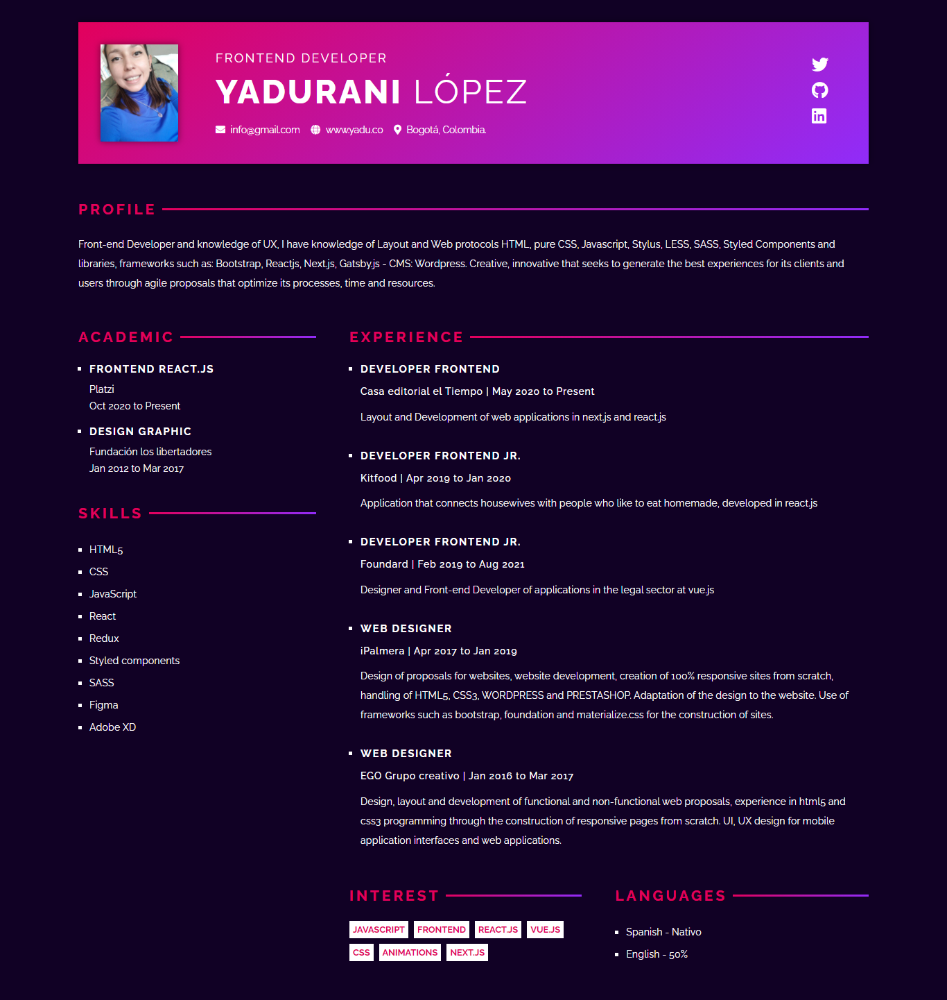

# Curriculum Vitae 😁

Se realiza el reto del curriculum vitae en React.js!!! 

## Challenge 😎
Solución al reto de Platzi Master.
## Overview 🔖



### Instalación
```
npm install
```

### Ejecución
```
npm run start
```

### Server
```
npm run server
```

### Compilar
```
npm run build
```

### Pruebas Unitarias
```
npm run test
```

### ESlint
```
npm run lint
```

### Licencia
Curriculum Vitae se lanza bajo la licencia [MIT](https://opensource.org/licenses/MIT).

## Contact

- Linkedin [YaduLopez](https://www.linkedin.com/in/yadu-lopez/)
- Twitter [@YaduLopezRivera](https://twitter.com/YaduLopezRivera)