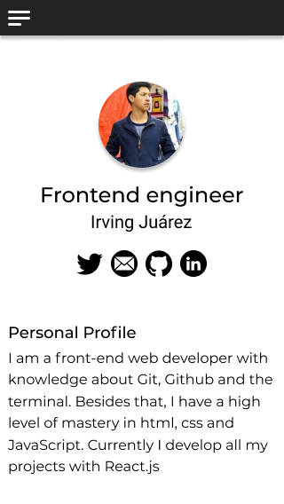
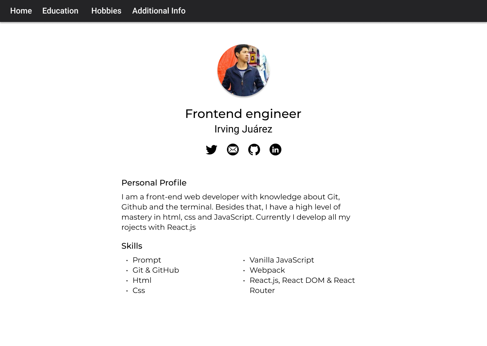

# frontend

## React Curriculum vitae

Crear tu curriculum vitae en React, analiza la estructura propuesta e inspirate para mostrar tu información.


## Proposed Design

### Mobile



### Desktop


### Retos
1. [Crear los componentes del proyecto](https://github.com/platzimaster/frontend/issues/1)
2. [Añadir estilos](https://github.com/platzimaster/frontend/issues/2)
3. [Crear función getData.js](https://github.com/platzimaster/frontend/issues/3)
4. [Integrar API](https://github.com/platzimaster/frontend/issues/4)
5. [Personalizar API](https://github.com/platzimaster/frontend/issues/5)
6. [Documentar](https://github.com/platzimaster/frontend/issues/6)

## Understanding the project
The project is based in components and those components build pages. All the pages include the Header and ProfileIntro components by default.
The router is in the App component and actually, it is the router (App) the one that call the 'fake API'. I did it so because for me it was more comfortable having the API call along with the pages that will use that data. I know that's not the case for all the projects, but in this project I think that was the best option

### Why I didn't use hooks?
I am starting with React and before to use hook, I would like to master classes. At least I understand how classes work and I would like to tackle some problems with these classes before knowing what are the advantages to use hooks in my projects.

### Issues I could not solve
There is something strange happening in the project in relation with the 'key' prop that all the lists need to have, because there is a warning telling me that in my component Home there is no the 'key' prop, but I already added to all lists that prop. It is something I can't help with, I don't know why it keeps showing up

As well I could't run the `test` script. This due the incompatibility with the React version. I tried with an Unofficial enzyme adapter for React v-17 but event thought, I could't figure out what I was doing wrong, I did all according to the documentation

### Quick start
We need to run two commands to start working. I recommend to open two consoles to run the 2 processes simultaneously
```
npm run server

npm run start
```

### Installation
The installation is something pretty important for me because my computer's memory. Therefore I had to get rid of some stuff I considered as 'not strictly necessary', among these items were:
- Stylus preprocessor
- Prettier
- Husky

I know prettier help us with the code, but it is not a big deal for the app to work properly, so...

```
npm install
```

### Execution
I have worked in some React projects before and I have some experience with components, pages and router. The way how the project is organized is pretty straight forward. Among the essential directories we have:
- assets: Only icons were used in this project
- components: The Layout works as a template. It is useful to gather all the components that will be in all the pages. In this case, the Header and the ProfileIntro are included in all the pages
- containers: We only have App, which works as the router
- pages: All the pages for this project, included the NotFound one, althought the latest doesn't have any special design
- styles: Separated into two sections, one for components and other for pages. All was done with plain css

```
npm run start
```

### Server
It was no any major problem with this 'fake API', it works nice and my app renders all the data just fine. I wanted to add a loader, but I think it was no so-necessary because the page mantains statics almost always...

```
npm run server
```

### Compilar
No problem at all

```
npm run build
```

### Unit testing
Above I explain why I could't run this command

```
npm run test
```

### ESlint
```
npm run lint
```

### Enviar solución de reto
Debes de crear un "Fork" de este proyecto, revolver los problemas y crear un Pull Request hacia tu repositorio.

### Contribuir
Si alguien quiere agregar o mejorar algo, lo invito a colaborar directamente en este repositorio: [frontend](https://github.com/platzimaster/frontend/)

### Licencia
frontend se lanza bajo la licencia [MIT](https://opensource.org/licenses/MIT).
