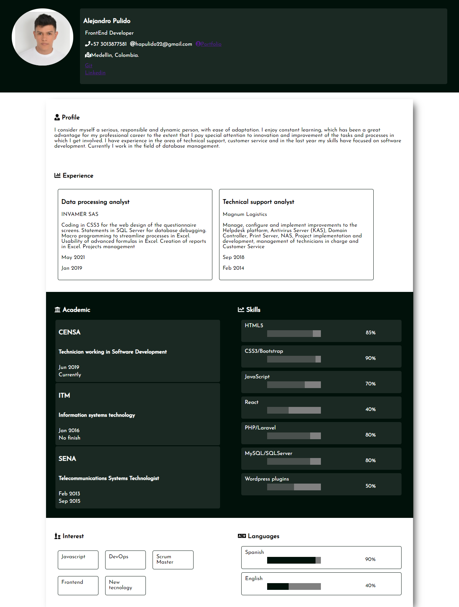

# frontend

## React Curriculum vitae

Creacion de Curriculum vitae con mi información reciente



### Retos
1. [Crear los componentes del proyecto] - Cumplido
2. [Añadir estilos] - Cumplido
3. [Crear función getData.js] - Cumplido
4. [Integrar API] - Cumplido
5. [Personalizar API] - Cumplido
6. [Documentar] - Cumplido

### Instalación
```
npm install
```

### Ejecución
```
npm run start
```

### Server
```
npm run server
```

### Compilar
```
npm run build
```

### Pruebas Unitarias
```
npm run test
```

### ESlint
```
npm run lint
```

### Enviar solución de reto
Debes de crear un "Fork" de este proyecto, revolver los problemas y crear un Pull Request hacia tu repositorio.


