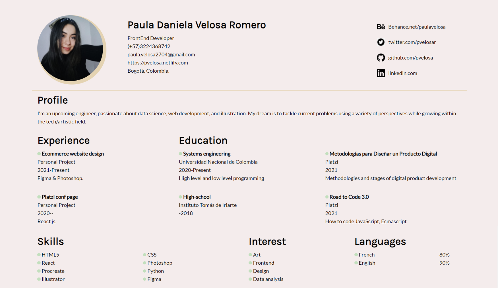
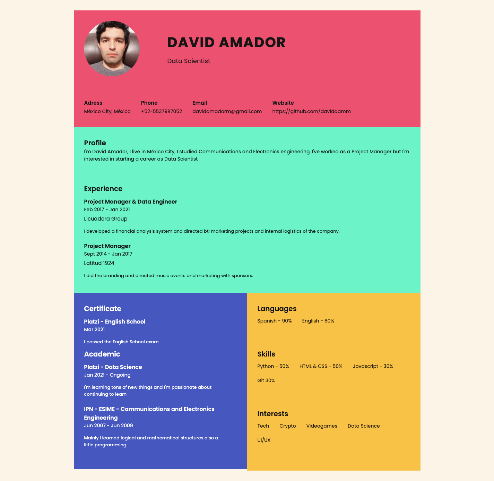

# React Curriculum Vitae 
This is a challenge for Platzi Master application. The goal: Make your CV in React.
This was the final result 
<details>
  <summary>Screenshot of CV</summary>
  
</details>

**Tools:** 
 - React JS  
 - Stylus

## stages of the Challenge

the challenge here was broken down into the following:
1.  [Create components](#creating-components)
2.  [Add styles](##Adding-styles)
4.  [Create function getData.js](#creating-getData.js)
5.  [Integrate  API](#Integrate-API)
6.  [Personalize API](#Personalize-API)
7.  [Document the project](#Documenting)

### Installation

```

npm install

```

  

### Execution

```

npm run start

```

  

### Server

```

npm run server

```

##  Creating Components 
  This  template was given as guidance
  <details>
  <summary>CV guidance</summary>
  
</details>

I made a low-fidelity wireframe inspired by it. 

 The first challenge was a bit confusing to me due to About component location. I thought it was the child of the Header, so I decided to move the About section inside the Header component. This way it will be easier to design. 

## Adding styles

Because I didn't have the complete info yet,  I make just a few changes at First, mainly creating a stylus file for each component. 

After adding my info (5th step) I started adding better styles to my components. I wanted a retro- groovy style, so I went for a palette with nude and beige as my main colors and red and green for the animation (accent) colors. I created a Palette.styl file to be coherent through all my components. 
- tip: As some elements are repeated continuously,  (in my case, there were for example bullet points and titles). I styled them in the main App.styl file, so I can use them in every component.

Furthermore, I added some animations to make the links and main objects stand out. I wasn't comfortable adding percentages of master to my skills, mainly because since I don't know what I don't know, evaluating the level of mastery was just so difficult for me. That's why I decided to set to 0 the opacity of  the percentage at 0 for then to be revealed while hovering each skill. 


## Creating  getData.js

This was by far the most complicated part of the process. Just because I didn't know how to use the server, I wasted 4 hours just to read the documentation of the challenge and type "npm run server" to have a clue on how to do this part 
- (read the documentation).

First, I added this function to my Header.js file, but there I just wasn't able to use async, await method. So I used .then and later, I transformed it into an async function in getData.js

## Integrate API

As I told you, in the components files I was not able to use Async, Await. so, i just created a fetch data function with .then method. It called getData.js to set  the state of each component with this data.

 - I was having trouble in here, but I found that initializing the data I was going to use solved the problem.

	    state = {

		data: {

			'languages': {
				 'name':  '',
				'percentage':  '' }],
		},
		}

## Personalize API
I created another json file: db.json and later upload package.json 

    "server": "json-server --watch db.json"

## Documenting 
thank you!  <3