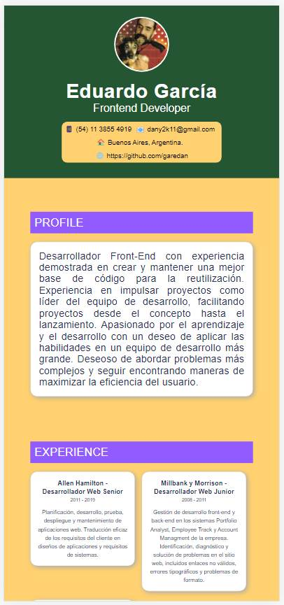

# frontend

## React Curriculum vitae

Crear tu curriculum vitae en React, analiza la estructura propuesta e inspirate para mostrar tu información.


### Retos
1. [Crear los componentes del proyecto](https://github.com/platzimaster/frontend/issues/1)
2. [Añadir estilos](https://github.com/platzimaster/frontend/issues/2)
3. [Crear función getData.js](https://github.com/platzimaster/frontend/issues/3)
4. [Integrar API](https://github.com/platzimaster/frontend/issues/4)
5. [Personalizar API](https://github.com/platzimaster/frontend/issues/5)
6. [Documentar](https://github.com/platzimaster/frontend/issues/6)

### Instalación
```
npm install
```

### Ejecución
```
npm run start
```

### Server
```
npm run server
```

### Compilar
```
npm run build
```

### Pruebas Unitarias
```
npm run test
```

### ESlint
```
npm run lint
```

### Documentación
Al ser este uno de los primeros proyectos que realizo con React, al menos sin seguir un tutorial, intente comprender cada paso que iba realizando. Busque ejemplos e intente darle mi toque personal. Aprendí un poco de testing, de lo cual no sabia nada. Espero que estén lo suficientemente correctos. Y lo mas importante, para mi, es que voy entendiendo el funcionamiento de React. Buen ejercicio.

El diseño es css puro, ya que no quise complicarme instalando frameworks, iconos, etc, porque todavía no se como integrarlos con React.

La función getData es bien sencilla y toma los datos del json incluido.

El json fue integrado con los componentes a través de la susodicha función getData.

La api fue personalizada con mis datos

La documentación es esta misma.



### Enviar solución de reto
Debes de crear un "Fork" de este proyecto, revolver los problemas y crear un Pull Request hacia tu repositorio.

### Contribuir
Si alguien quiere agregar o mejorar algo, lo invito a colaborar directamente en este repositorio: [frontend](https://github.com/platzimaster/frontend/)

### Licencia
frontend se lanza bajo la licencia [MIT](https://opensource.org/licenses/MIT).
