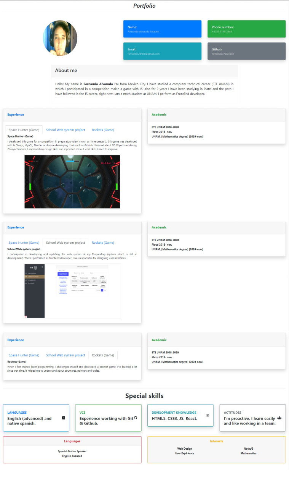

# frontend

## React Curriculum vitae

#Frontend documentation
##Requirements for execution
- Have Node.JS installed in the system 
 ###Steps for execution
- Clone the Repository and get into
- Install dependencies (npm i)
- Initiate server ( npm run server)
- Initiate de application (npm run start)
- enjoy

##Challenges and their resolutions 
- Create the project components
The components  were created with React using the schedule proposed in the fork, and they use Props (working with getData function and my API), UseEffect and UseState
- Add styles
The styles were implemented with Bootstrap
- Create getData.js function
The components used getData function, using fetch method 
- Integrating API
The API  is run by npm start server and is a package,json
- Custom API
The API were custom adding the information and my curriculum
##Results

#----------------------------------

## Instalación
```
npm install
```

### Ejecución
```
npm run start
```

### Server
```
npm run server
```

### Compilar
```
npm run build
```

### Pruebas Unitarias
```
npm run test
```

### ESlint
```
npm run lint
```


### Contribuir
Si alguien quiere agregar o mejorar algo, lo invito a colaborar directamente en este repositorio: [frontend](https://github.com/platzimaster/frontend/)

### Licencia
frontend se lanza bajo la licencia [MIT](https://opensource.org/licenses/MIT).
