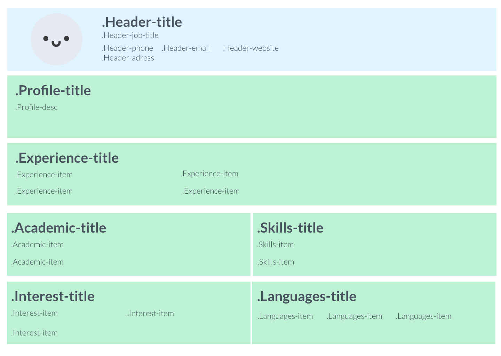
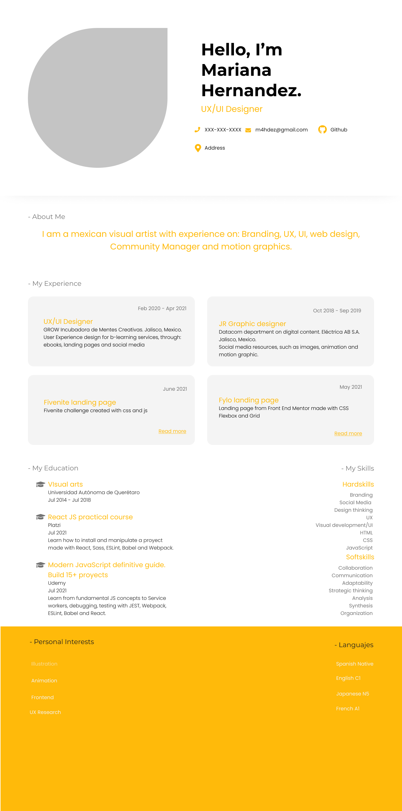
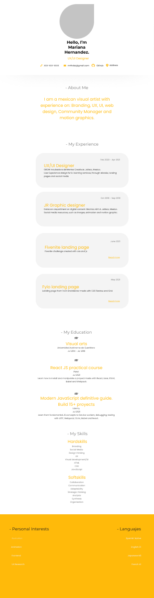
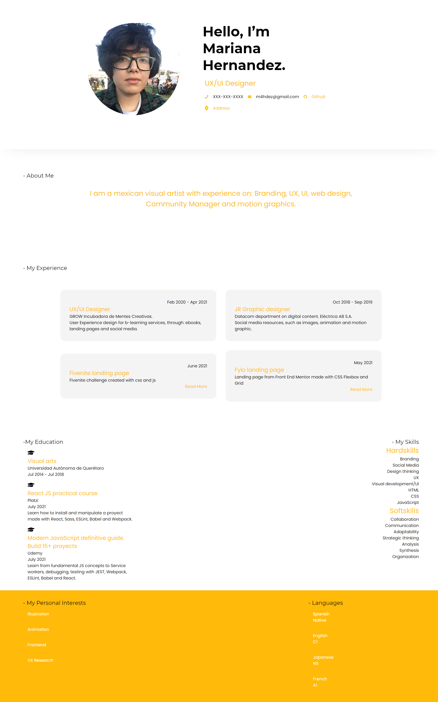
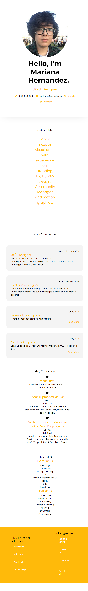

# Frontend Platzi Master by Mariana Hernandez

Hello again! I'm Mariana and I'm going to use this space to tell you how I solved this challenge.

After a month of preparing myself taking some JS courses, I was finally able to understand React JS and how to get the fake API done; specially thanks to the React JS practical course from Platzi. It felt like a long month because I put all of my theorical knowledge on practice with some extra projects, and they were really enlightening. I let all of my frustrations behind and, although there were moments were I struggled with the CSS or the About.jsx component, enjoyed working on the challenge.

So here it is, please take a moment to read each step of this documentation.

## Table of contents

- [Creating components](#creating-components)
- [Adding styles](#adding-styles)
- [Creating function getData.js](#creating-function-getdata)
- [API integration](#api-integration)
- [Personalize API](#personalize-api)
- [Document](#document)
- [Available Scripts](#available-scripts)

## Creating components

<details>
  <summary>Original Structure</summary>
  
</details>

<details>
  <summary>Figma desktop design</summary>
  
</details>

<details>
  <summary>Figma mobile design</summary>
  
</details>

I had some struggles with the original structure because there was a component, the "About" component, that wasn't clear. I assumed it was part of the Header component so I developed it as a children, but I had trouble getting the CSS done because I didn't understand how to adapt my original stylus to it. I finally decided to use a Grid because it seemed easier to understand it as a two dimension design (that's how I make decisions on using flexbox or grid on the layout).

This time I took some time to also make a mobile version of my app on Figma. This made the responsive development a lot easier.

I used:

- Flexbox
- CSS Grid

## Adding styles

Even thought the first time I loved using Stylus, this time I was more familiar with Sass so the text indent was a bit difficult to me and I was starting to freak out when my css wasn't showing the way I intended. Fortunately I got used to it and the process run smoothly.

Here are some of the snipets I'm prouder of

**JSX**

```jsx
const Header = ({ avatar, name, children }) => {
  return (
    <div className="Base-container">
      <div className="Header-container">
        <figure className="Header-pic">
          
        </figure>
        <div className="Header-name">
          <h1 className="Header-title">{name}</h1>
        </div>
        {children}
      </div>
    </div>
  );
};
```

**Styl**

```styl
.Base-container
  justify-content center
  padding 10rem
  box-shadow 0px 0px 75px -35px rgba(0, 0, 0, 0.25)

.Header-container
  display: grid
  grid-template-columns: 1fr 1fr
  grid-template-rows: 1fr 1fr
  grid-template-areas:
    ".Header-pic Header-title" ".Header-pic About-container"
  width: 100%
  height: 100%
  gap 1rem 10rem
```

## Creating function getData

I finally understand this part better, because now I have a clear understantment about how fetch works.

This is my snippet of it

**JS**

```js
function getData(API) {
  return fetch(API)
    .then(res => res.json())
    .then(data => data);
}

export default getData;
```

## API integration

I learned a lot from the Webpack course from Platzi to get this done, so here's my snippet. Now I know how to consume a Fake API, and I'm ready to consume other kinds of APIS.

**JSX**

```jsx
const [data, setData] = useState({});

useEffect(() => {
  getData('http://localhost:3000/data').then(setData);
}, []);
```

## Personalize API

This was the easiest part of the project, but since I finally understood what actually meant to personalize an API, everything just fit in.

## Document

Thank you for scrolling! Here are the final results.

<details>
  <summary>💻 Desktop view</summary>
  
</details>

<details>
  <summary>📱 Mobile view</summary>
  
</details>

<br />

## Available Scripts

```
npm install
```

### Ejecucion

```
npm run start
```

### Server

```
npm run server
```

### Compilar

```
npm run build
```

### Pruebas Unitarias

```
npm run test
```

### ESlint

```
npm run lint
```

<p align=center>Made with ♥ by themattfire</p>
