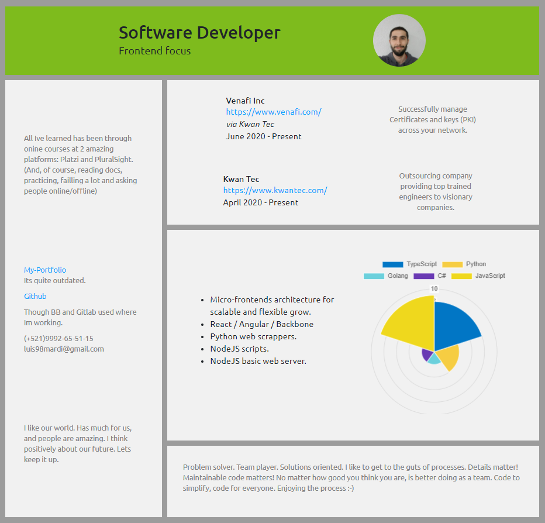

# Getting started
This project is Luis Martinez' proposal to the Platzi Master Frontend challenge.

To run locally:  
  First off you better install deps required:  
  `npm i`  

  Now, the data used for the UI gets fetched from a fake API, so we need to serve the data to successfully render the UI:  
  `npm run server`  

  Finally, at any other terminal run:  
  `npm start`  

## React Curriculum vitae

Initial structure:
<br/>


Proposal answer:
<br/>


### Retos
1. [Crear los componentes del proyecto](https://github.com/platzimaster/frontend/issues/1)
2. [Añadir estilos](https://github.com/platzimaster/frontend/issues/2)
3. [Crear función getData.js](https://github.com/platzimaster/frontend/issues/3)
4. [Integrar API](https://github.com/platzimaster/frontend/issues/4)
5. [Personalizar API](https://github.com/platzimaster/frontend/issues/5)
6. [Documentar](https://github.com/platzimaster/frontend/issues/6)

### Instalación
```
npm install
```

### Ejecución
```
npm run start
```

### Server
```
npm run server
```

### Compilar
```
npm run build
```

### Pruebas Unitarias
```
npm run test
```

### ESlint
```
npm run lint
```

### Licencia
[MIT](https://opensource.org/licenses/MIT).
