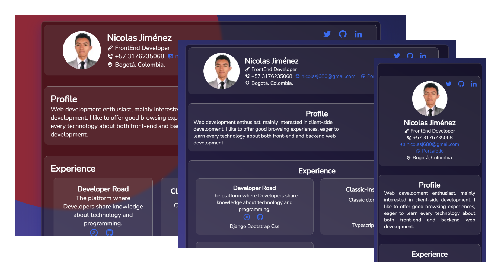

# frontend

## React Curriculum vitae

Crear tu curriculum vitae en React, analiza la estructura propuesta e inspirate para mostrar tu información.


## ➡️ [Resultado final](https://frontend-woad-iota.vercel.app/) ⬅️

## Docs ( 🛣️ Mi experiencia con el desafío )
<details>
<summary>Create the project components #1: Analyze the project and identify its structure</summary>
<br>
When I looked closely at the structure of the project, I found it already had a previously elaborated structure, however a series of extra configurations and a couple of files are needed. I started this point by creating an index.js file in the root of the "components" folder so that from there a single import would be made and not "saturate" other files with the "dot hell".
😊👌
</details>

<br>

<details>
<summary>
    Add styles #2: Create the styles to give it the desired design, keep the proposed structure. Use @Dribble for inspiration.
</summary>
<br>
❌🙃
One of the main problems I had at the time of carrying out the project was thinking about a design, although I'm not so bad at it, it is a fact that I can spend hours just thinking about "-"hat colors I should to use?" (and so it was) I spent more of a morning creating a color palette and a design that I liked enough and that in turn did not break the scheme given at the beginning, since one of the challenges was to maintain the base structure.

Fortunately, Google came to save the country and among many designs I chose to use an effect called "Glassmorphosm", all that remained was to think of some good colors (because at the beginning, the ones I had in mind were not bad ... but, maybe is not works
<a href="https://res.cloudinary.com/dtukhkgvj/image/upload/v1621141810/screen_lrdk96.jpg"> here a prove. </a>
) so I opted to use an Apple palette.
<a href="https://www.breakfreegraphics.com/design-blog/glassmorphism-ui-a-new-variant-of-neumorphism/"> Here was my inspiration. </a>
</details>

<br>

<details>
<summary>
Create getData.js function #3: Create getData.js function to consume an API</summary>
<br>
❌🙃
Creating the function was one of the simplest parts of the test, however it is one thing to create it and another to make it work, since here I had the problem that Webpack was not willing to accept "sugar syntax" like  async / await, And although it is true that I could have solved it using the already known "promises", I wanted to make use of these characteristics, for which I was forced to investigate how to adapt Webpack to these characteristics, it was not very difficult, but I did take longer than expected.

</details>

<br>

<details>
<summary>Integrate API #4: Start the test server and integrate the proposed information into your application.
</summary>
<pre>
&lt;npm run server&gt;
</pre>
<br>
Integrating the api was simple, but what perhaps was not so simple was to think of an optimal way to distribute the information throughout the application without having to make more than one call to the api or "mess up" the code by creating more states of the necessary ones, for which it seemed convenient to use the api context that React provides, in this way I centralized the information at one point and then distributed.
</details>

<br>

<details>
<summary>Custom API #5:Customize the data.json file in the root of the project with your information.
 If you deploy your own API in a cloud service it is a plus.
 </summary>
<br>
Customizing the api was quick, but I did not like the idea of ​​having the file static, so I was forced to create a small server in Express and mount it in Heroku, I wanted to take that extra step. (I mounted the repo to GitLab, Why? Well, I don't like having my GitHub account untidy. <a href="https://gitlab.com/Nicolas-alt/simple-rest-server/-/tree/main">Here is the code</a>)

</details>

<br>

<details>
<summary>Document #6:Create the necessary documentation for the application in the document of your Pull Request.
 Explain in detail the steps taken, describe what were your main blocks and your solutions.
 </summary>
<br>
To document the project I chose to use "JsDoc" since it allows me to create the necessary comments for the code in a very simple way. Additionally, in the Readme.md I left this same section of steps, since it seemed more elegant to me.

</details>

<br>

<details>
<summary>Upgrade [Bonus] #7:
 Please review the project and update to the latest versions of the project dependencies.
 </summary>
<br>
To be honest this was the first thing I did before starting to go through the entire structure of the project, I went through the package.json to see what commands and settings they had available and then updated all the dependencies.
</details>
<br>

## ⚒️ Set Up
### 🚚 API
[The api was deployed in Heroku](https://shrouded-thicket-27001.herokuapp.com/)

### 🛠️ Instalación
```
npm install
```

### 🏃 Ejecución
```
npm run start
```

### 💻 Server
```
npm run server
```

### 🧱 Compilar
```
npm run build
```

### ⚗️ Pruebas Unitarias
```
npm run test
```

### 🕵 ESlint
```
npm run lint
```


### Retos
1. [Crear los componentes del proyecto](https://github.com/platzimaster/frontend/issues/1)
2. [Añadir estilos](https://github.com/platzimaster/frontend/issues/2)
3. [Crear función getData.js](https://github.com/platzimaster/frontend/issues/3)
4. [Integrar API](https://github.com/platzimaster/frontend/issues/4)
5. [Personalizar API](https://github.com/platzimaster/frontend/issues/5)
6. [Documentar](https://github.com/platzimaster/frontend/issues/6)
### Enviar solución de reto
Debes de crear un "Fork" de este proyecto, revolver los problemas y crear un Pull Request hacia tu repositorio.

### Contribuir
Si alguien quiere agregar o mejorar algo, lo invito a colaborar directamente en este repositorio: [frontend](https://github.com/platzimaster/frontend/)

### Licencia
frontend se lanza bajo la licencia [MIT](https://opensource.org/licenses/MIT).
