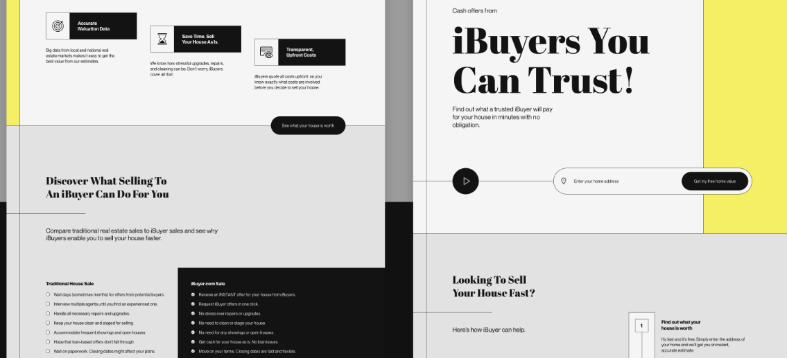
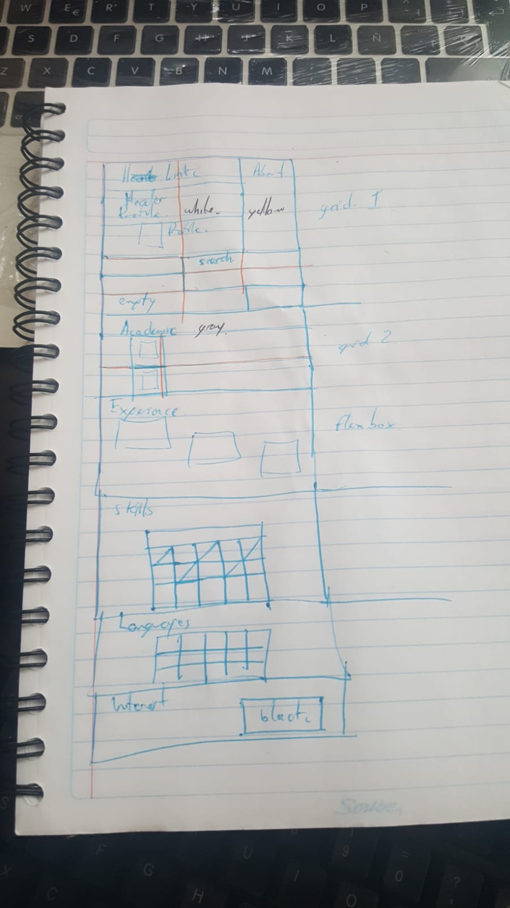

Se resolvieron los retos de Platzi Master siguientes:

Retos
1. Crear los componentes del proyecto
2. Añadir estilos
3. Crear función getData.js
4. Integrar API
5. Personalizar API
6. Documentar

**Reto 1.** se creo cada componente, en el caso de los que se tiene la misma estructura, al menos para el problema planteado, se uso un componente previo anidado sobre el que solicita solo para cumplir el requerimiento del nombre del componente con el nombre específico. Esto de puede apreciar en el código.

**Reto 2.** Los estilos se crearon en sass, aunque el proyecto venia originalmente en otro preprocesador, me es mas comodo en sass, para ello se actualizaron los modulos a utilizar, quitando los que no, y agregando los que si.

En la parte del diseño me base en dribbble.com como sugerian, en especifico en el siguiente [enlace](https://dribbble.com/shots/15601784-iBuyer-Real-Estate-Landing-Page-Design/attachments/7389452?mode=media).

Se muestran los aspecto de dicho diseño:

En el caso de componentes tipo tablero de ajedrez que van en posiciones distintas, por medio de su índice se fueron colocando en su posición usando la operación módulo.

En este sentido repersenta la mayor inversión de tiempo del reto, no por la dificultad, pero si por la revisión y adecuación de cada elemento de la página.

**Reto 3,** La función getData, al menos el archivo del mismo nombre se creó, no puedo debatir si va o se usa los hooks con la función useData, esto porque aún soy principiante con react, y dentro de este la función correspondiente. Esto genera un error en los tests, fuera de ello funciona.

**Reto 4** Se leen todos los datos de la API, al menos los que entendi se requerían.

**Reto 5.** The easiest part of all.

**Reto 6.** Es este documento.
 
 Los pasos tomados fueron:
 - Clonar el repositorio, adeuación dentro de mi entorno local.
 - Revisión de la esctructura, tanto carpetas como archivos de código y de configuración.
 - Instalación de los paquetes necesarios y adecuación de algunos otros.
 - Etapa de escritura de codigo, específicamente los componentes en jsx, la etapa de diseño fue posterior.
 - Etapa de diseño, primero pensar en algún diseño, no es mi fuerte, y se trabajo sobre el ya mostrado, antes de escribir código css alguno, realice un bosquejo en papel.
 Se muestra tal bosquejo:
 
 - Etapa de escritura de archivos sass, esta fue la etapa de mayor tiempo, no se si en general suele ser así, o es para mi un reto u oportunidad de mejora.
 Obviamente de acuerdo a la información a mostrar se realizaron ciertas adecuaciones.
- Etapa de documentación, en ella se agregaron ciertos acomentarios al código, y la elaboración de este documento.

## Mayores retos y soluciones
Como suele ser usual al escribir código son los bugs, algunos de ellos por los typos, en el momento de haberlos encontrado se respira y se continua, hasta el siguiente en este ciclo que ya conocemos, pero satisfactorio al final, obvio con la ayuda de recursos en línea, entre ellos doucmentación oficial, stackoverflow, etc. Sin mayor problema por el lenguaje, en este caso el inglés.

Otro reto es mi etapa de aprendizaje en cada una de estas tecnologías, considero que con prática puedo mejorar mis habilidades, no es cuestión de no dedicarse, si no que se me plantee un reto donde pueda entrar de lleno, p.e. trabajar en añguna empresa, obvio.

Algo importante es que de menos de un año hacia la fecha, tengo muchos más conocimiento y estoy más actualizado que entes de ese tiempo, gracias a Platzi, y mi sueño es trabajar en algua empresa de mayor rango que las locales, por las raznoes obias, como son un mejor salario claro, pero más importante, porque se que puedo cumplir el reto y apoyar con mi esfuerzo en donde se me requiera. 